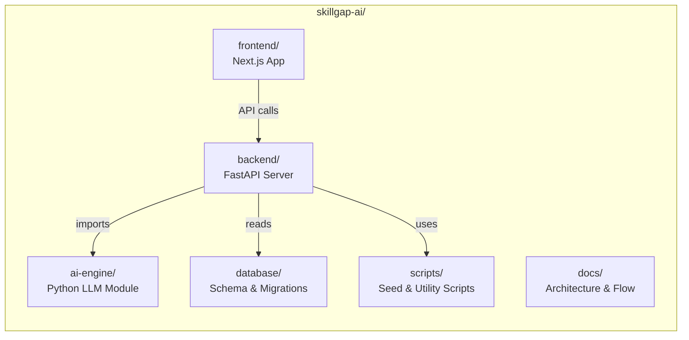
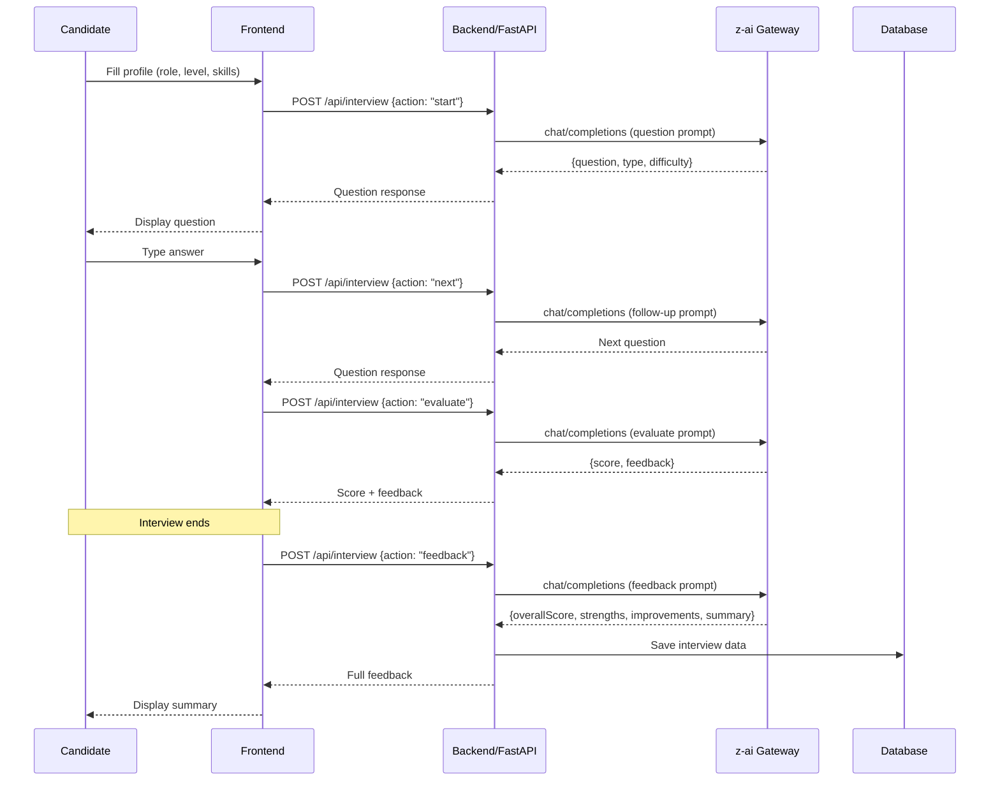

# SkillGap AI — Architecture

## Overview

SkillGap AI is an AI-powered technical interview simulator that lets candidates practice mock interviews with real-time AI feedback, per-question scoring, voice input, and performance analytics. The system is built as a monorepo with four major components.

## System Architecture

```mermaid
graph TB
    subgraph Client
        Browser[Browser / PWA]
    end

    subgraph Frontend["Frontend (Next.js 16)"]
        UI[React UI<br/>Tailwind + shadcn/ui]
        Store[Zustand Store<br/>Interview State]
        API_Route[API Route<br/>/api/interview]
    end

    subgraph Backend["Backend (FastAPI)"]
        FastAPI[FastAPI Server<br/>:8000]
        InterviewService[Interview Service]
        LLMSvc[LLM Service<br/>httpx → z-ai gateway]
        DBLayer[Database Layer<br/>SQLAlchemy]
    end

    subgraph AIEngine["AI Engine (Python)"]
        Prompts[Prompt Templates<br/>question / evaluation / feedback / hint]
        AILLM[LLM Service<br/>httpx → z-ai gateway]
    end

    subgraph Database["Database"]
        SQLite[SQLite (dev)]
        Supabase[Supabase / PostgreSQL (prod)]
    end

    subgraph External["z-ai Gateway"]
        Gateway[LLM Gateway<br/>OpenAI-compatible API]
    end

    Browser --> UI
    UI --> Store
    UI --> API_Route
    API_Route --> Gateway
    Browser --> FastAPI
    FastAPI --> InterviewService
    InterviewService --> LLMSvc
    LLMSvc --> Gateway
    InterviewService --> DBLayer
    DBLayer --> SQLite
    DBLayer --> Supabase
    AILLM --> Gateway
    Prompts --> AILLM
```

## Component Diagram



## Component Details

### 1. Frontend (`frontend/`)

**Tech Stack**: Next.js 16, TypeScript, Tailwind CSS 4, shadcn/ui, Framer Motion, Zustand

| Feature | Implementation |
|---|---|
| Profile Setup | Role/level/skills form with quick-start presets |
| Interview Chat | Real-time chat with AI interviewer, typing indicators |
| Practice Mode | Hint generation for practice sessions |
| Per-Question Scoring | 1-5 star rating after each answer |
| AI Feedback | Overall score (1-10), strengths, improvements |
| Bookmarking | Save questions for later review |
| Interview History | localStorage-persisted session list |
| Dark Mode | next-themes with class-based switching |
| Voice Input | Web Speech API for spoken answers |
| TTS | Speech synthesis for reading questions aloud |
| Pause/Resume | Pause interview with timer stop |
| Export | JSON download, text copy, PDF via print |
| Keyboard Shortcuts | Ctrl+Enter, Ctrl+K, Ctrl+P, ? |

**Key Files**:
- `src/app/page.tsx` — Main page with all 3 phases (setup → interview → summary)
- `src/lib/interview-store.ts` — Zustand store for interview state
- `src/app/api/interview/route.ts` — Next.js API route (calls z-ai SDK)
- `src/app/layout.tsx` — Root layout with ThemeProvider
- `src/app/globals.css` — Custom CSS animations and teal theme

### 2. Backend (`backend/`)

**Tech Stack**: FastAPI, Python 3.11+, httpx, SQLAlchemy, Pydantic v2

| Endpoint | Method | Description |
|---|---|---|
| `/api/health` | GET | Health check |
| `/api/interview` | POST | Main interview API (all actions) |

**Interview Actions** (via `action` field in POST body):

| Action | Input | Output |
|---|---|---|
| `start` | profile (role, level, skills) | First question + type + difficulty |
| `next` | profile, messages | Next question + type + difficulty |
| `skip` | profile, messages | Easier/different question |
| `hint` | profile, messages, question | Hint text |
| `evaluate` | question, answer, profile | Score (1-5) + feedback |
| `feedback` | profile, messages | overallScore, strengths, improvements, summary |

**Key Files**:
- `app/main.py` — FastAPI app with CORS and lifespan
- `app/api/interview.py` — Interview endpoint router
- `app/services/interview_service.py` — Business logic for all actions
- `app/services/llm_service.py` — LLM gateway client (httpx)
- `app/config.py` — Settings from env vars and .z-ai-config
- `app/db/database.py` — SQLAlchemy engine and session
- `app/models/` — Pydantic request/response models

### 3. AI Engine (`ai-engine/`)

**Tech Stack**: Python 3.11+, httpx

A standalone Python module that provides a clean API for LLM-powered interview operations. Reads prompt templates from `.txt` files for easy iteration.

| Function | Returns | Description |
|---|---|---|
| `generate_question(role, level, ...)` | `{question, type, difficulty}` | Generate first question |
| `generate_next_question(role, level, ..., messages)` | `{question, type, difficulty}` | Generate follow-up question |
| `generate_skip_question(role, level, ..., messages)` | `{question, type, difficulty}` | Generate easier question after skip |
| `evaluate_answer(question, answer, ...)` | `{score, feedback}` | Evaluate an answer (1-5) |
| `generate_feedback(role, level, ..., messages)` | `{overallScore, strengths, improvements, summary}` | Overall interview feedback |
| `generate_hint(question, ...)` | `{hint}` | Generate a practice hint |

### 4. Database (`database/`)

**Tech Stack**: PostgreSQL (Supabase) / SQLite (dev)

| Table | Purpose | Key Columns |
|---|---|---|
| `users` | User profiles | id, name, email, created_at |
| `interviews` | Interview sessions | id, user_id, role, level, skills, score, duration |
| `questions` | Questions asked | id, interview_id, question_text, question_type, difficulty, order_index |
| `answers` | Candidate answers | id, question_id, answer_text, score, feedback, duration_seconds |
| `bookmarks` | Saved questions | id, user_id, question_id, created_at |

## API Reference

### Frontend → z-ai Gateway (direct via Next.js API route)

```
POST /api/interview
Content-Type: application/json

{
  "action": "start" | "next" | "skip" | "hint" | "evaluate" | "feedback",
  "profile": { "role": "SDE", "level": "Mid", "skills": "Python, React" },
  "messages": [...],
  "question": "...",       // for hint/evaluate
  "answer": "...",         // for evaluate
  "questionTypes": ["DSA"] // optional filter
}
```

### Frontend → Backend (FastAPI)

```
POST /api/interview
Content-Type: application/json

Same body structure as above.
```

### Backend → z-ai Gateway

```
POST {ZAI_GATEWAY_URL}/chat/completions
Authorization: Bearer {ZAI_API_KEY}
Content-Type: application/json

{
  "messages": [
    {"role": "assistant", "content": "<system prompt>"},
    {"role": "user", "content": "<context + instruction>"}
  ],
  "thinking": {"type": "disabled"}
}
```

## Data Flow



## Design Decisions

| Decision | Rationale |
|---|---|
| Prompt templates as `.txt` files | Easy to edit without touching code; version-controllable; cacheable |
| httpx for LLM calls | Async, connection pooling, timeout control; no SDK dependency needed |
| Zustand for state | Lightweight, no boilerplate; built-in localStorage persistence |
| Action-based API | Single endpoint with `action` field keeps API simple and extensible |
| JSON response format | LLM outputs structured JSON; parsers handle malformed responses gracefully |
| Dual database support | SQLite for zero-config dev; PostgreSQL/Supabase for production RLS |
| RLS policies | Supabase row-level security ensures users only access their own data |

## Deployment

| Component | Platform | URL |
|---|---|---|
| Frontend | Vercel | `https://my-project-nine-virid-24.vercel.app` |
| Backend | Docker / Render | `http://localhost:8000` |
| Database | Supabase | Managed PostgreSQL |
| AI | z-ai Gateway | Internal LLM service |
