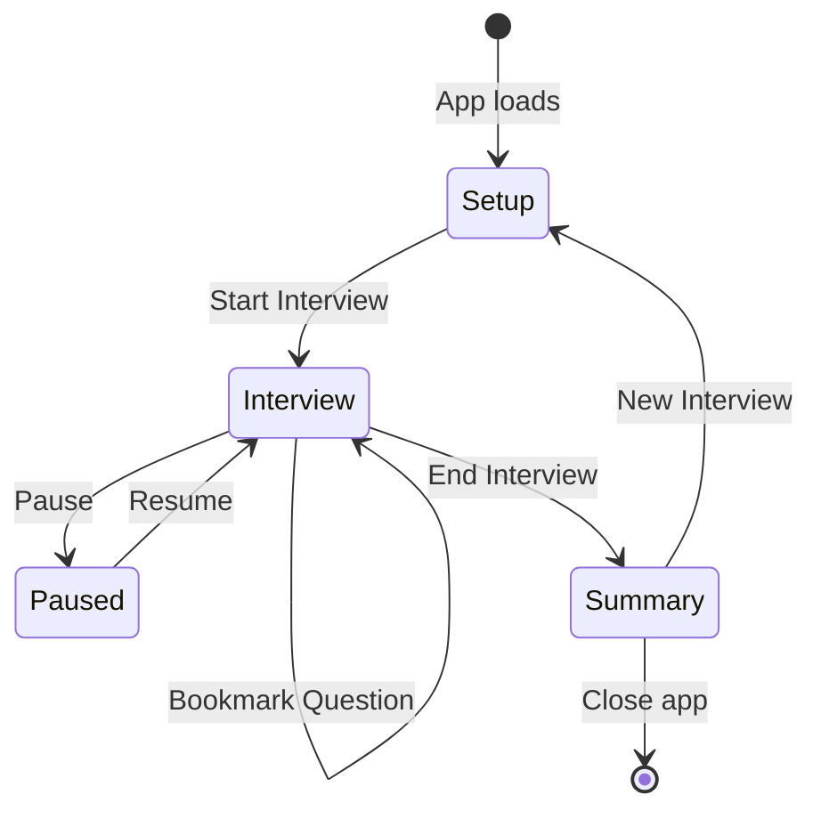
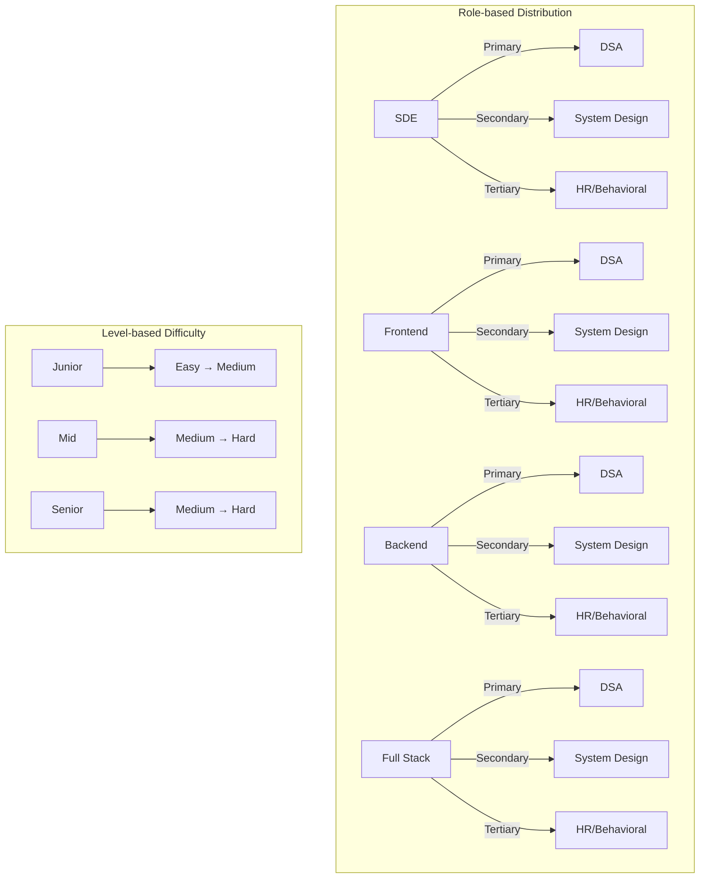
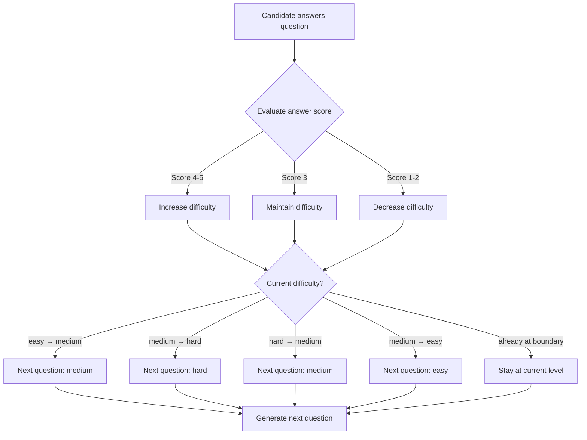
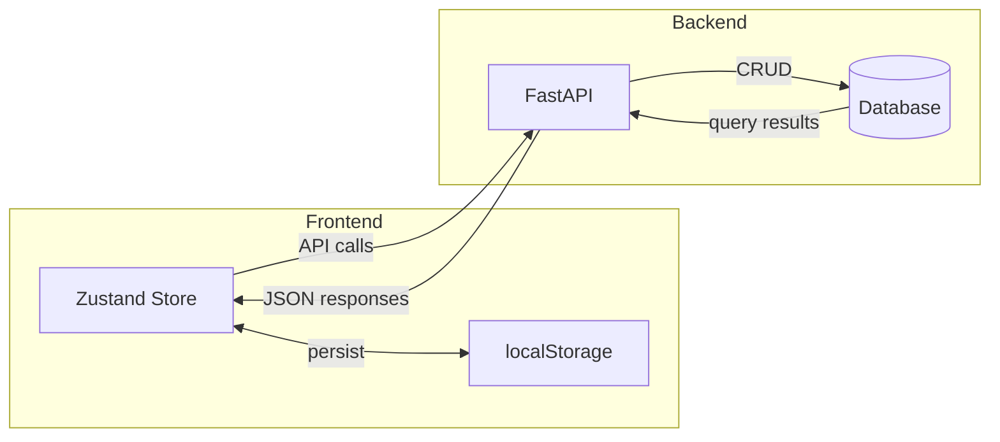

# Interview Flow

This document describes the complete interview flow in SkillGap AI, from profile setup to final feedback.

## Flow Overview

```mermaid
sequenceDiagram
    actor C as Candidate
    participant UI as Frontend UI
    participant Store as Zustand Store
    participant API as API Layer
    participant LLM as z-ai Gateway

    %% Phase 1: Profile Setup
    rect rgb(240, 253, 250)
        Note over C,LLM: Phase 1 — Profile Setup
        C->>UI: Open application
        UI->>Store: Initialize state
        Store-->>UI: Load history from localStorage
        C->>UI: Select role (SDE / Frontend / Backend / Full Stack)
        C->>UI: Select level (Junior / Mid / Senior)
        C->>UI: Enter skills (comma-separated)
        C->>UI: Toggle practice mode (optional)
        C->>UI: Select question types (optional)
        C->>UI: Click "Start Interview"
        UI->>Store: Set phase = "interview"<br/>Save profile
    end

    %% Phase 2: Interview
    rect rgb(240, 249, 255)
        Note over C,LLM: Phase 2 — Interview Chat

        %% First question
        UI->>API: POST /api/interview {action: "start", profile}
        API->>LLM: chat/completions (question prompt)
        LLM-->>API: {question, type, difficulty}
        API-->>UI: Question response
        UI->>Store: Add interviewer message
        UI-->>C: Display question with badge (Q1, type, difficulty)

        %% Answer loop
        loop For each question
            C->>UI: Type or speak answer
            UI->>Store: Add candidate message
            UI->>API: POST /api/interview {action: "next", profile, messages}
            API->>LLM: chat/completions (follow-up prompt)
            LLM-->>API: {question, type, difficulty}
            API-->>UI: Next question response
            UI->>Store: Add interviewer message
            UI-->>C: Display next question

            %% Per-question evaluation (automatic)
            par Auto-evaluate answer
                UI->>API: POST /api/interview {action: "evaluate", question, answer}
                API->>LLM: chat/completions (evaluate prompt)
                LLM-->>API: {score, feedback}
                API-->>UI: Score (1-5) + feedback
                UI->>Store: Save questionScore
                UI-->>C: Show star rating next to answer
            end

            %% Optional: Hint (practice mode)
            opt Practice mode — Hint requested
                C->>UI: Click lightbulb button
                UI->>API: POST /api/interview {action: "hint", question}
                API->>LLM: chat/completions (hint prompt)
                LLM-->>API: {hint}
                API-->>UI: Hint text
                UI-->>C: Display hint as [Hint] system message
            end

            %% Optional: Skip question
            opt Skip question
                C->>UI: Click "Skip" or Ctrl+K
                UI->>API: POST /api/interview {action: "skip", profile, messages}
                API->>LLM: chat/completions (skip prompt)
                LLM-->>API: Easier/different question
                API-->>UI: New question
                UI-->>C: Display new question
            end

            %% Optional: Bookmark question
            opt Bookmark question
                C->>UI: Click bookmark icon
                UI->>Store: Toggle bookmarkedQuestions
            end

            %% Optional: Pause
            opt Pause interview
                C->>UI: Click Pause or Ctrl+P
                UI->>Store: Set isPaused = true
                Note over UI: Timer stops, input disabled
                C->>UI: Click Resume
                UI->>Store: Set isPaused = false
                Note over UI: Timer resumes
            end
        end

        %% End interview
        C->>UI: Click "End Interview"
        UI->>Store: Set phase = "complete"
    end

    %% Phase 3: Summary & Feedback
    rect rgb(255, 251, 240)
        Note over C,LLM: Phase 3 — Summary & Feedback
        UI->>API: POST /api/interview {action: "feedback", profile, messages}
        API->>LLM: chat/completions (feedback prompt)
        LLM-->>API: {overallScore, strengths, improvements, summary}
        API-->>UI: Full feedback
        UI->>Store: Save feedback + save to history
        UI-->>C: Display summary with:
        Note over UI,C: • Animated score donut (1-10)<br/>• Performance radar chart<br/>• Strengths list (green)<br/>• Improvements list (amber)<br/>• Per-question scores<br/>• Bookmarked questions<br/>• Session comparison<br/>• Difficulty curve chart
    end

    %% Export options
    opt Export transcript
        C->>UI: Click "Export JSON" / "Copy Transcript" / "Download PDF"
        UI->>UI: Generate export from store data
        UI-->>C: Download / copy to clipboard
    end

    %% New interview
    C->>UI: Click "New Interview"
    UI->>Store: resetInterview()
    UI-->>C: Return to Phase 1
```

## State Transitions

## Question Type Distribution

## Adaptive Difficulty Flow

## Data Persistence Flow

## Keyboard Shortcuts

| Shortcut | Action | Phase |
|---|---|---|
| `Ctrl+Enter` | Send answer | Interview |
| `Ctrl+K` | Skip question | Interview |
| `Ctrl+P` | Pause/Resume | Interview |
| `?` | Show shortcuts overlay | Any |
| `Escape` | Close dialog/overlay | Any |
